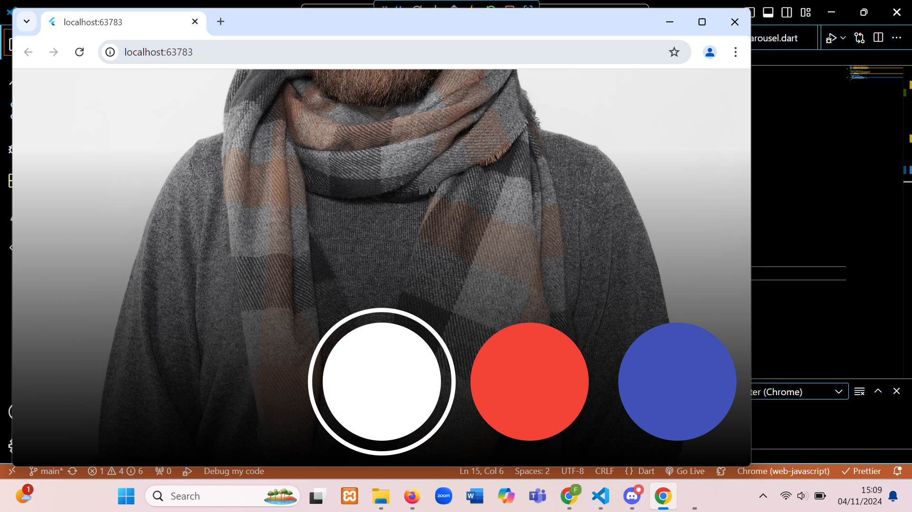

1. jelaskan yang di maksud async
   void: Menunjukkan bahwa fungsi tidak mengembalikan nilai.
   async: Menandakan bahwa fungsi adalah asinkron dan dapat menggunakan await untuk menunggu hasil operasi asinkron.

2. Jelaskan fungsi dari anotasi @immutable dan @override
   @immutable: Menandakan bahwa objek dari kelas tersebut tidak dapat diubah setelah dibuat, membantu menjaga integritas data.
   @override: Menunjukkan bahwa metode dalam kelas anak mengubah implementasi dari metode yang ada di kelas induk, meningkatkan kejelasan dan keamanan kode.
